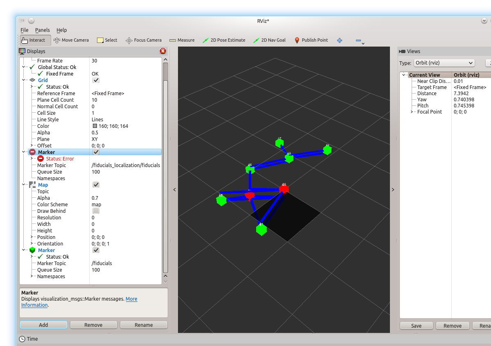

# Simultaneous Localization and Mapping Using Fiducial Markers

## Overview

This package implements a system that uses ceiling mounted
fiducials (think QR Codes) to allow a robot to identify
its location and orientation.  It does this by constructing
a map of the ceiling fiducials.  Once the map has been
constructed, the robot can identify its location by locating
itself relative to one or more ceiling fiducials.

A
  [more detailed document](https://docs.google.com/a/mrjim.com/document/d/1GsqAXgagWFZp891-5EDgfnYioPGjC1JdtXoIOecaQ-w)
is available that describes the system in more detail.

In order to use this system you will need to do the following:

* Software Installation.  You will have to install the appropriate
  software.

* Mount Ceiling Fiducials.  You will need to print and install
  a number of fiduicals on your ceiling.  The fiduicals have to
  be big enough that your camera can resolve them.

* Camera Installation.  You will need to install and calibrate
  an upward pointing camera. On Ubiquity Robotics robots this has already been done.

## Installing software

First you must install ROS (Robot Operating System),
see [install ROS](http://wiki.ros.org/ROS/Installation) for more details.

Currently you must install from source--binaries are not yet available.
First, create a ROS catkin workspace, if you don't already have one:

     $ mkdir -p ~/catkin_ws/src
     $ cd ~/catkin_ws/src
     $ catkin_init_workspace

Then get the source:

    $ git clone https://github.com/UbiquityRobotics/fiducials 
    $ git clone https://github.com/UbiquityRobotics/raspicam_node 
    $ cd ..
    $ catkin_make    

Install inkscape

     $ sudo apt-get install inkscape

## Generating fiducials

The fiducials are typically generated from the laptop/desktop.

Fiduical tags are generated using the following commands:

	cd /tmp
        rosrun fiducial_lib Tags num ...

Thus, the following command will generate `tag42.svg` and `tag43.svg`:

        rosrun fiducial_lib Tags 42 43

To generate a 100 at a time, use the following command:

        rosrun fiducial_lib Tags 17{0,1,2,3,4,5,6,7,8,9}{0,1,2,3,4,5,6,7,8,9}

This will generate `tag1700.svg` through `tag1799.svg`.

To convert the `.svg` files to to `.pdf` files use the`inkscape`
program and the following commands:

        # Convert a single .svg to a single .pdf
        inkscape --without-gui --export-pdf=tag42.pdf tag42.svg
        # Convert a bunch at a time:
        for n in 17{0,1,2,3,4,5,6,7,8,9}{0,1,2,3,4,5,6,7,8,9} ; do \
           inkscape --without-gui --export-pdf=tag$n.pdf tag$n.svg ; \
           done
        # Merge the pdf files:
        sudo apt-get install poppler-utils
        pdfunite tag17??.pdf tags17xx.pdf
		rm tag*.svg

You can print the .pdfs using using `evince`:

	sudo apt-get install evince
    evince tags17xx.pdf

## Camera Installation:

On Ubiquity Robotics robots the camera in already installed and calibrated. For users of other robots, the process is described in an Appendix.

## Map Creation

To create an empty map file with fiducial 301 (the id of 301 is arbitrary) at the origin:

        mkdir -p ~/.ros/slam
        echo '301 0.0 0.0 0.0 180.0 0.0 180.0 0.0 1' > ~/.ros/slam/map.txt

The format of this file is id x y z pan tilt roll numObservations.

This assumes the fiducial is on the ceiling, and the 180 degree rotations are used
so that the pose of fiducials is determined in the co-ordinate system of the floor.  
Increased accuracy can be gained by specifying the height of the fiducial (z), 
and that this can also be determined from the output of 
`fiducial_slamp.py`.

It is important that the transform from base link to the camera frame is
correctly specified.  The launch files are currently in transition, but
at the moment, `fiducial_detect/launch/raspi_pose.launch` is where this transform
is specified. 

## Running Fiducials

1. First create an empty map as above.

2. In order to see the fiducials during map building, run rviz:

        roslaunch fiducial_detect fiducial_rviz.launch

Note that the robot node should be running (so that the transform from odom to base_link is published)
and at aleat one of the fiducials that is in the the map should have been observed before rviz 
can display anything in the map frame.

3. Then perform a quick map generation:

        roslaunch fiducial_slam fiducial_raspi_3d_map.launch

4. Then launch fiducial localization:

        roslaunch fiducial_slam fiducial_raspi_3d.launch
		
5. Finally run the navigation:

        roslaunch fiducial_detect navigation_noscan.launch
		
At this point the robot should be capable of executing move_base and other mavigation functions.		

## Visualization with rviz

While building the map, you should start to see something that looks as follows:

> 

* Red cubes represent fiducials that are currently in view
  of the camera.

* Green cubes represent fiducials that are in the map, but
  not currently in the view of the camera.

* Blue lines connect pairs of fiducials that have shown
  up in the camera view at the same time.  The map is constructed
  by combining fiducial pairs.
  
## Appendix 1. Formats and Programs  

## File Formats:

### `map.txt` file format:

The format of `map.txt` is a series of lines of the form:

        id x y z pan tilt roll variance numObservations [neighbors ...]

## Programs

The program should be present in your fiducials build directory:

        cd .../catkin_ws/build/fiducials

### Tags

The Tags program is used to generate .svg files for tags.  Running Tags:

    Tags 41 42

will generate tag41.svg and tag42.svg.  To print:

    inkscape --without-gui --export-pdf=tag41.pdf tag41.svg

	
## Appendix 2. Nodes

### fiducial_detect fiducial_detect

This node finds fiducial markers in images stream and publishes their vertices
(corner points) and estimates 3D transforms from the camera to the fiducials.
It also has 2D SLAM built in.

#### Parameters

**tag_height** Name of the tag_height file (default `Tag_Heights.xml`).  This
file is used to specify the height of the fiducials for 2D slam.

**map_file** Name of the file where the generated 2D SLAM-based map should be
stored (default `ROS_MAP`).

**log_file** Name of the log file (default `fiducuals.log.txt`).

**data_directory** Name of the directory where tag_height and map_file reside,
relative to `~/.ros`.

**odom_frame** If this is set to a non-empty string, then the result of the
localization is published as a correction to odometry.
For example, the odometry publishes the tf from map to odom, and this node
publishes the tf from odom to base_link, with the tf from
map to odom removed. Default: not set.
 
**map_frame** The name of the map (world) frame.  Default `map`.

**pose_frame** The frame for our tf. Default `base_link`.

**publish_images** If `true`, images containing fiducials are published. Default
`false`.

**publish_interesting_images** If `true`, 'interesting' images containing fiducials are
published. Default `false`. This is for debug purposes.

**publish_tf** If `true`, transforms are published. Default `false`.

**publish_markers** If `true`, visualization markers are published. Default 
`false`.

**estimate_pose** If `true`, 3D pose estimation is performed and fiducial
transforms are published. Default `true`.

**fiducial_len** The length of one side of a fiducial in meters, used by the
pose estimation.  Default 0.146.

**undistort_points** If `false`, it is assumed that the input is an undistorted
image, and the vertices are used directly to calculate the fiducial transform.
If it is `true`, then the vertices are undistorted first. This is faster, but
less accurate.  Default `false`.

**fiducials_are_level** If `true`, it is assumed that all fiducials are level, as
would be the case on ceiling mounted fiducials. In this case only 3DOF are estimated.
Default `true`.

#### Published Topics

**fiducuals** A topic of `visualization_msgs/Marker` messages that can be viewed
in rviz for debugging, if that option is selected.

**vertices** A topic of `fiducial_detect/Fiducial*` messages with the detected
fiducial vertices.

**fiducials_images** An `ImageTransport*` of images containing fiducials, if that
option is selected.

**interesting_images** `ImageTransport*` of interesting images, if that option
is selected.

**fiducial_transforms** A topic of `fiducial_pose/FiducialTransform` messages 
with the computed fiducial pose.

#### Subscribed Topics

**camera** An `ImageTransport` of the images to be processed.

**camera_info** A topic of `sensor_msgs/CameraInfo` messages with the camera
intrinsic parameters.

### fiducial_slam fiducial_slam.py

This node performs 3D Simultaneous Localization and Mapping (SLAM) from the 
fiducial transforms. For the mapping part, pairs of transforms are combined
to determine the position of fiducials based on existing observations.
For the localization part, fiducial transforms are combined with fiducial poses
to estimate the camera pose (and hence the robot pose).

## Appendix 3. Topics and Parameters

**map_file** Path to the file containing the generated map (this must exist). Default `map.txt`.

**trans_file** Path to a file to store all detected fidicial transforms. Default `trans.txt`.

**obs_file** Path to a file to store all detected fidicial observations. Default `obs.txt`.

**odom_frame** If this is set to a non-empty string, then the result of the localization is published as a correction to odometry.
For example, the odometry publishes the tf from map to odom, and this node publishes the tf from odom to base_link, with the tf from
map to odom removed. Default: not set.
 
**camera_frame** The name of the camera frame.  Default `camera`.

**map_frame** The name of the map (world) frame.  Default `map`.

**pose_frame** The frame for our tf. Default `base_link`.

**publish_tf** If `true`, transforms are published. Default `true`.

**republish_tf** If `true`, transforms are republished until a new pose is calculated. Default `true`.

**mapping_mode** If `true` the map updated and saved more frequently.

**use_external_pose** If `true` then the node will attempt to use an external 
estimate of the robot pose (eg from AMCL) to estimate the pose of fiducials
if no known fiducials are observed.

**future** Amount of time (in seconds) to future-date published transforms.
Default 0.0.

#### Published Topics

**fiducuals** A topic of `visualization_msgs/Marker` messages that can be viewed
in rviz for debugging.

**fidicual_pose** a topic of `geometry_msgs/PoseWithCovarianceStamped` containing
the computed pose.

**tf** Transforms

#### Subscribed Topics

**fiducial_transforms** A topic of `fiducial_pose/FiducialTransform` messages with
fiducial pose.

**tf** Transforms

### fiducial_slam init_amcl.py

This node will reinitialize amcl by republishing the pose reported from 
fiducial_slamp.py to amcl as an initial pose.

#### Parameters

**cov_thresh** The threshold of covariance reported in *amcl_pose* for
reinitializing it.  Default 0.2.

#### Published Topics

**initial_pose** (geometry_msgs/PoseWithCovarianceStamped) The initial pose 
sent to AMCL

#### Subscribed Topics

**amcl_pose** (geometry_msgs/PoseWithCovarianceStamped) The pose from AMCL. The
covariance of this is examined to determine if AMCL needs re-initializing.

**fiducial_pose** (geometry_msgs/PoseWithCovarianceStamped) The pose from 
fiducial_slam.py

## Appendix 4. Cameras

If you are not using a Ubiquity Robotics robot, you will need to install a camera and hook it into ROS.

### Raspberry Pi Camera

The
  [Raspberry Pi 2 Model B](https://www.raspberrypi.org/products/raspberry-pi-2-model-b/)
is a 900MHz quad core ARM7 single board computer with 1GB or RAM.
It has a variety of connectors including a CSI MIPI camera connector
for their
  [Rapsberry Pi Camera](https://www.raspberrypi.org/products/camera-module/)
which has some
  [nice specifications](https://www.raspberrypi.org/documentation/hardware/camera.md).

We currently recommend using the raspicam_node for this camera
  [raspicam_node](https://github.com/UbiquityRobotics/raspicam_node)

## Calibrating a camera

The fiducials package contains a calibration file for the raspberry 
PI 2 camera.  The procedure for calibrating a camera is only necessary
if you change the lens or image size used

The
  [Monocular Camera Calibration tutorial](http://wiki.ros.org/camera_calibration/Tutorials/MonocularCalibration)
shows how to calibrate a single camera.

The
  [8x6 checkerboard](http://wiki.ros.org/camera_calibration/Tutorials/StereoCalibration?action=AttachFile&do=view&target=check-108.pdf)
and the
  [7x6 checkerboard](http://wiki.ros.org/camera_calibration/Tutorials/StereoCalibration?action=AttachFile&do=view&target=check_7x6_108mm.pdf)
are rather large and require specialized printers to print out at
full scale.  They can be printed on more common printer sizes
with auto scaling turned on.  Be sure to carefully measure the
square size in millimeters and convert to meters by dividing by 1000.

Assuming a checker board with 38mm squares, the following command can be used
to calibrate the camera:

        rosrun camera_calibration cameracalibrator.py camera:=pgr_camera_node image:=pgr_camera_node/image_raw --size 8x6 --square 0.038 --no-service-check

For the Raspberry Pi 2 camera:

	# On Rasperry Pi:
	roslaunch fiducial_detect raspicam.launch
        # Note: This launch file refers to a calibration file that
        # probably does not exist.  The resulting error is OK.

	# On a laptop/desktop with ROS_MASTER_URI and ROS_HOSTNAME
	# env. variables set.
        rosrun camera_calibration cameracalibrator.py camera:=camera image:=camera_node/image_raw --size 8x6 --square 0.038 --no-service-check

Read the
  [Monocular Calibration](http://wiki.ros.org/camera_calibration/Tutorials/MonocularCalibration)
tutorial.  When the calibrator comes up, the [Calibrate], [Save],
and [Commit] buttons are dimmed out.  After the [Calibrate]
button shows up, click on it *once*.   After the [Save] and [Commit]
buttons show up, click on the [Save] button *once*.  Do not waste
your time clicking on [Commit], that feature is not supported by
`gscam`.

The resulting calibration is written into `/tmp/calibrabrationdata.tar.gz`.
Unpack the data as follows:

        cd /tmp
        mkdir camara_data
        cd camera_data
        gunzip -c ../calibrationdata.tar.gz | tar xvf -

Now you get to convert the file `ost.ini` to a `.yaml` file.

        rosrun camera_calibration_parsers ost.ini camera_WIDTHxHEIGHT.yaml
	mkdir -p ~/.ros/slam
	cp camera_WIDTHxHEIGHT.yaml ~/.ros/slam

where *WIDTH* is the image width and *HEIGHT* is the image height.
Make sure that `.../fiducials/fiducial_detect/launch/raspi.launch`
points to this file:

        <param name="camera_info_url"
               value="file:///home/ubuntu.ros/slam/raspi_WIDTHxHEIGHT.yaml"/>

After this step, when you run the camera, you should no longer
get the calibration file error.
	
	
